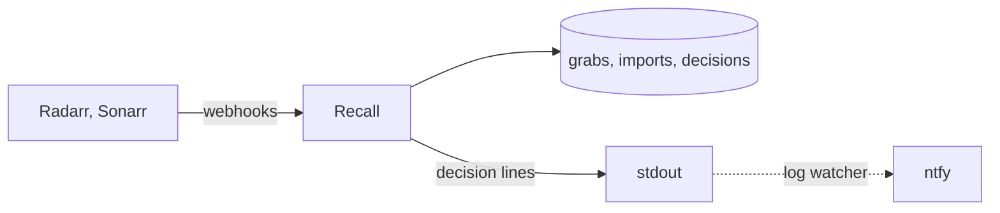

# Design

## Problem

Radarr grabbed this release from BeyondHD. The indexer's title parsed cleanly and matched three custom formats.

```
100 Percent Wolf 2020 1080p BluRay DD5.1 x264-PTer

quality   Bluray-1080p
group     PTer
formats   1080p Bluray, 1080p Quality Tier 5, Dolby Digital
score     +881400
```

The torrent finished and Radarr imported it. At import it scores the torrent's own name, not the indexer's. This torrent was named with a space before the group, so the group parsed as empty, the tier format that needs a group fell off, and a penalty format took its place.

```
100 Percent Wolf.2020.1080p.BluRay.DD5.1.x264- PTer

quality   Bluray-1080p
group     (none)
formats   1080p Bluray, Dolby Digital, Release Group (Missing)
score     -299599
```

Same download, same file, two scores over a million apart. Radarr keeps the second one. On the next search a HANDJOB release at +880000 beat the file on disk, and Radarr replaced a good copy with a worse one.

Nothing in either app compares the two scores, and no log line shows them together. Both apps do send a webhook at grab and at import, and each carries the download id and that event's score.

## How it works



Recall keeps the grab, and when the import arrives compares the two and writes a decision: clean, or drift with the delta and the formats lost and gained. A drift line carries both titles and both scores.

Recall only receives and writes. Paging is a log watcher's job, so Recall knows nothing about ntfy.

## Storage

Three append-only JSON Lines files: grabs, imports, decisions. Each line is the normalised record plus the raw body. The grab file is read into a map by download id at start; that is the only lookup. Everything else is jq.

## Milestones

1. **Bootstrap.** A push to develop builds an image that answers a health check and accepts a webhook.
2. **Parse.** Radarr and Sonarr bodies become one normalised event, tested against captured payloads.
3. **Store.** Grabs and imports appended to files; the grab map rebuilt at start.
4. **Decide.** Import compared with grab; the decision appended and logged.
5. **Register.** Recall creates its own connection on each instance, with a shared secret it checks on every event.
6. **Status.** Decisions marked fixed, accepted, or superseded; grabs with no import as a query.
