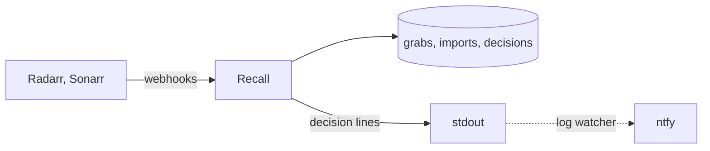

# Design

## Problem

Radarr and Sonarr score a release twice: at grab against the indexer's title, at import against the torrent's own name. When the names differ the file can land far below the score it was chosen at, and the next search replaces it with something worse. Upstream: [Radarr #11422](https://github.com/Radarr/Radarr/issues/11422).

Example: a PTer 1080p grabbed at +881400, imported at -299599 because the torrent name had `x264- PTer` and the group parsed as empty, then replaced by a release at +880000.

## How it works

Both apps send a webhook on grab and on import. Both carry the download id and that event's score. Recall keeps the grab, and when the import arrives compares the two and writes a decision: clean, or drift with the delta and the formats lost and gained. A drift line carries both titles and both scores.

Recall only receives and writes. Paging is a log watcher's job, so Recall knows nothing about ntfy.

## Storage

Three append-only JSON Lines files: grabs, imports, decisions. Each line is the normalised record plus the raw body. The grab file is read into a map by download id at start; that is the only lookup. Everything else is jq.

## Milestones

1. **Bootstrap.** A push to develop builds an image that answers a health check and accepts a webhook.
2. **Parse.** Radarr and Sonarr bodies become one normalised event, tested against captured payloads.
3. **Store.** Grabs and imports appended to files; the grab map rebuilt at start.
4. **Decide.** Import compared with grab; the decision appended and logged.
5. **Register.** Recall creates its own connection on each instance, with a shared secret it checks on every event.
6. **Status.** Decisions marked fixed, accepted, or superseded; grabs with no import as a query.
