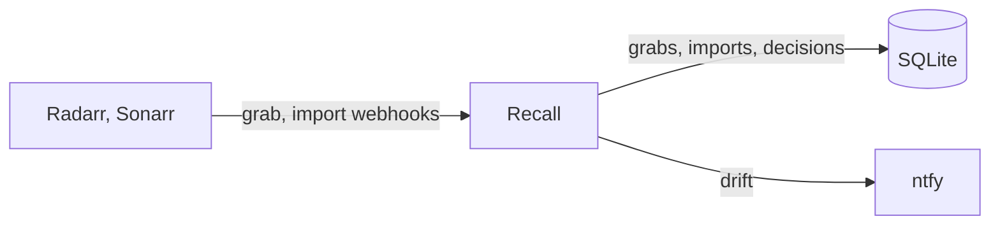

# Design Document

## Abstract

Radarr and Sonarr score a release twice. At grab they score the indexer's title. At import they score the torrent's own name, or the file's name inside a multi-file torrent, and let ffprobe override language and quality. When the two names differ the import can land at a much lower score than the grab. The next search then sees a release that scores higher than the file and grabs it, even when it is really a worse copy.

The example that started this: a 1080p Blu-ray from PTer grabbed at +881400 and imported at -299599, because the torrent was named with `x264- PTer` and the release group parsed as empty. It was then replaced by a release scoring +880000.

This is a known open issue upstream ([Radarr #11422](https://github.com/Radarr/Radarr/issues/11422)). The only reliable check is to compare the grab score with the import score for the same download, which no log line does. Both apps send a webhook on grab and on import carrying the download id and that event's score, so a small service can receive both and compare.

## How it works

Recall is one binary with one job. It receives every webhook from every instance, keeps the grab and the import for each download, and records a decision for each import: clean, or drift with the delta and the formats lost and gained. Drift pages ntfy with both titles so the file can be manually imported before it is traded away. Decisions carry a status so they can be marked fixed, accepted, or superseded when a later import replaces the file.

Fixing the file, for example by renaming the torrent at grab time, is deliberately out of scope until the alert has proven itself.

## What the webhooks carry

Both events share a download id, the torrent hash, which is the key. Radarr's grab carries the indexer's title, the release group, the score and the custom formats it matched. Its import carries the torrent's name as `sceneName`, the file's path, the score and formats matched against the file, and the grab's title again under `release`. So a single import event holds both titles; the grab is needed only for the score and formats it was chosen at.

Each app names itself in every event through `instanceName`, which is set per container. One Recall serves every instance.

Raw bodies are stored beside the normalised columns. The normaliser is a view of them and can be re-run when it changes.

## Milestones

1. **Bootstrap.** A push to develop produces an image that answers a health check and accepts a webhook.
2. **Parse.** Radarr and Sonarr grab and import bodies become one normalised event, tested against captured payloads.
3. **Store.** Grabs, imports, and raw bodies in SQLite.
4. **Decide and alert.** An import is compared with its grab; drift is recorded and pages ntfy.
5. **Register.** Recall creates its own webhook connection on each instance from their API keys, with a shared secret it checks on every event.
6. **Status.** Decisions can be marked fixed, accepted, or superseded; grabs with no import fall out as a query.
