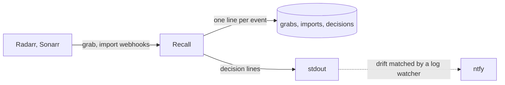

# Design Document

## Abstract

Radarr and Sonarr score a release twice. At grab they score the indexer's title. At import they score the torrent's own name, or the file's name inside a multi-file torrent, and let ffprobe override language and quality. When the two names differ the import can land at a much lower score than the grab. The next search then sees a release that scores higher than the file and grabs it, even when it is really a worse copy.

The example that started this: a 1080p Blu-ray from PTer grabbed at +881400 and imported at -299599, because the torrent was named with `x264- PTer` and the release group parsed as empty. It was then replaced by a release scoring +880000.

This is a known open issue upstream ([Radarr #11422](https://github.com/Radarr/Radarr/issues/11422)). The only reliable check is to compare the grab score with the import score for the same download, which no log line does. Both apps send a webhook on grab and on import carrying the download id and that event's score, so a small service can receive both and compare.

## How it works

Recall is one binary with one job. It receives every webhook from every instance, keeps the grab and the import for each download, and records a decision for each import: clean, or drift with the delta and the formats lost and gained. A drift line carries both titles and both scores so the file can be manually imported before it is traded away.

Recall only receives and writes. It never calls out. Paging is left to a log watcher, Loggifly in the lab, that matches the drift line on stdout and posts it to ntfy. That keeps alert routing in one place and keeps Recall free of topics, URLs, and retries.

Fixing the file, for example by renaming the torrent at grab time, is deliberately out of scope until the alert has proven itself.

## Storage

Three append-only files of JSON Lines, one object per line: grabs, imports, decisions. A line is the normalised record with the raw webhook body as one more field, so the file is the archive and the index at once. Nothing is ever rewritten; a status change is a further decision line. At a few grabs a day the grab file is read once at start into a map by download id, which is the only lookup the server needs. Everything else is a scan that jq does better than a database would in a distroless container.

## What the webhooks carry

Both events share a download id, the torrent hash, which is the key. Radarr's grab carries the indexer's title, the release group, the score and the custom formats it matched. Its import carries the torrent's name as `sceneName`, the file's path, the score and formats matched against the file, and the grab's title again under `release`. So a single import event holds both titles; the grab is needed only for the score and formats it was chosen at.

Each app names itself in every event through `instanceName`, which is set per container. One Recall serves every instance.

The normaliser is a view of the raw body and can be re-run over the files when it changes.

## Milestones

1. **Bootstrap.** A push to develop produces an image that answers a health check and accepts a webhook.
2. **Parse.** Radarr and Sonarr grab and import bodies become one normalised event, tested against captured payloads.
3. **Store.** Grabs and imports appended to files, with the raw body, and the grab map rebuilt at start.
4. **Decide.** An import is compared with its grab; the decision is appended and logged in a form a log watcher can page on.
5. **Register.** Recall creates its own webhook connection on each instance from their API keys, with a shared secret it checks on every event.
6. **Status.** Decisions can be marked fixed, accepted, or superseded; grabs with no import fall out as a query.
